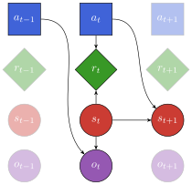

# Logo for POMDPs.jl

See the [Pluto.jl](https://github.com/fonsp/Pluto.jl) notebook with TikZ code here: [src/logo.jl](./src/logo.jl)

Adapted from the dynamic decision network for POMDPs in *Algorithms for Decision Making* (Kochenderfer).

    

Adheres to the Julia colors defined here: https://github.com/JuliaLang/julia-logo-graphics
- 🔵 Actions are blue
- 🟢 Rewards are green (signaling something "good")
- 🔴 States are red
- 🟣 Observations are purple (i.e. "noisy" red)